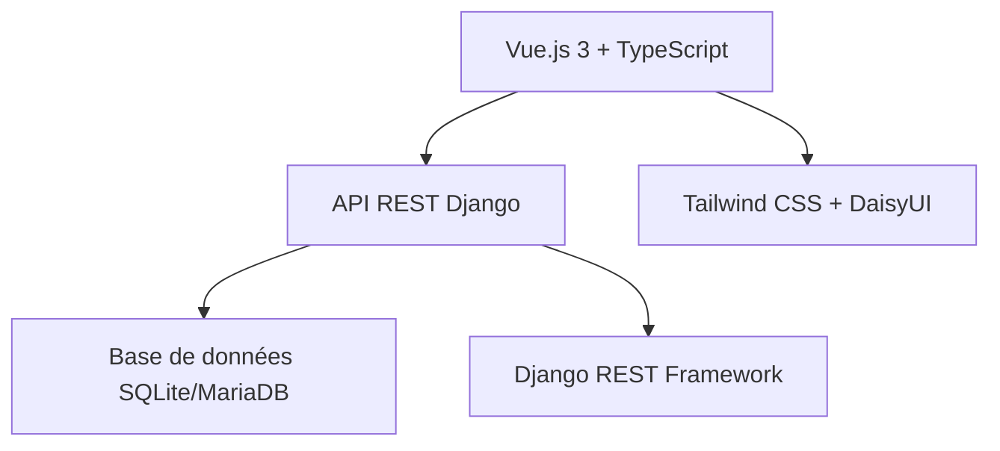

# ♻️ Redplast - Révolutionner la recherche durable

<div align="center">


**L'avenir de la recherche scientifique responsable**

*Accompagner la transition écologique des laboratoires de recherche*

[](https://vuejs.org/)
[](https://djangoproject.com/)
[](https://typescriptlang.org/)
[](https://tailwindcss.com/)

</div>

---

## 📋 Sommaire

- [Note Importante - Projet de candidature](#️-note-importante---projet-de-candidature)
- [Démo en ligne](#-démo-en-ligne)
- [Notre mission](#-notre-mission)
- [Compétences démontrées dans ce projet](#-compétences-démontrées-dans-ce-projet)
- [Fonctionnalités phares](#-fonctionnalités-phares)
- [Architecture technique](#️-architecture-technique)
- [Démarrage rapide](#-démarrage-rapide)
- [API documentation](#-api-documentation)
- [Design system](#-design-system)
- [Fonctionnalités avancées](#-fonctionnalités-avancées)
- [Easter Egg - Découverte de la candidature](#-easter-egg---découverte-de-la-candidature)
- [Roadmap & vision](#-roadmap--vision)
- [À Propos du développeur](#-à-propos-du-développeur)
- [Contact & opportunités](#-contact--opportunités)

---

## ⚠️ **Note importante - Projet de candidature**

> **Contexte :** Ce projet **Redplast** est un **projet fictif** créé spécialement dans le cadre d'une **candidature à une offre d'emploi**. 
> 
> Plutôt que d'envoyer un CV traditionnel, j'ai choisi de démontrer mes compétences techniques et créatives en développant une application web complète qui illustre mon expertise en développement full-stack moderne.
>
> **L'Université de Bordeaux** et le projet **Redplast** sont utilisés comme contexte fictif pour donner du réalisme à cette démonstration technique.

---

## 🎥 **Démo en ligne**

<div align="center">

### **Découvrez l'application en action !**

👉 **[Voir la démo][https://redplast.netlify.app/]**

*Testez toutes les fonctionnalités directement dans votre navigateur*

[](https://app.netlify.com/projects/redplast/deploys)

**💡 Astuce :** N'oubliez pas de cliquer sur **"Proposer un protocole"** pour découvrir la surprise ! 🎭

</div>

---

## 🎯 **Notre mission**

**Redplast** transforme la façon dont les laboratoires de recherche abordent leur impact environnemental. En partenariat avec l'**Université de Bordeaux**, nous développons une plateforme collaborative qui permet aux chercheurs de partager, découvrir et implémenter des protocoles scientifiques durables.

### **Pourquoi Redplast ?**

- **Impact scientifique** : Réduire l'empreinte plastique sans compromettre la qualité de la recherche
- **Collaboration** : Une communauté de chercheurs engagés pour l'environnement
- **Mesure d'impact** : Suivre et quantifier les réductions d'usage du plastique
- **Innovation** : Découvrir les alternatives les plus prometteuses

---

## 💼 **Compétences démontrées dans ce projet**

### **Frontend moderne**
- **Vue.js 3 + Composition API** : Réactivité et performance optimales
- **TypeScript** : Type safety et maintenabilité du code
- **Tailwind CSS + DaisyUI** : Design system cohérent et responsive
- **Animations CSS** : Micro-interactions et transitions fluides

### **Backend robuste**
- **Django + Django REST Framework** : API REST complète et sécurisée
- **Architecture MVT** : Séparation claire des responsabilités
- **Base de données relationnelle** : Modélisation et requêtes optimisées

### **Bonnes pratiques**
- **Architecture modulaire** : Code organisé et maintenable
- **Responsive design** : Expérience utilisateur optimale sur tous supports
- **Accessibilité** : Interfaces inclusives et conformes aux standards
- **Documentation** : Code commenté et documentation utilisateur

---

## ✨ **Fonctionnalités phares**

### **Interface moderne & intuitive**
- Design responsive et accessible sur tous les appareils
- Animations fluides et micro-interactions soignées
- Système de couleurs inspiré de l'identité bordelaise

### **Gestion intelligente des protocoles**
- **Catégorisation avancée** : Collecte, Alternatives, Réutilisation, Analyse, Formation, Stérilisation
- **Export PDF** professionnel pour documentation
- **Système de badges** visuels par catégorie


---

## 🏗️ **Architecture technique**

### **Stack moderne & performante**



| Composant | Technologie | Avantage |
|-----------|-------------|----------|
| **Frontend** | Vue.js 3 + TypeScript | Réactivité, type safety, performance |
| **Backend** | Django + DRF | Robustesse, sécurité, évolutivité |
| **Design** | Tailwind + DaisyUI | Cohérence, rapidité de développement |
| **Base de données** | SQLite/MariaDB | Flexibilité selon l'environnement |

---

## 🚀 **Démarrage rapide**

### **Prérequis**
- Python 3.8+ 
- Node.js 18+ 
- Git 

### **Installation express**

```bash
# 1️⃣ Cloner le projet
git clone https://github.com/Maeva-RODRIGUES/redplast
cd redplast

# 2️⃣ Backend Django
python -m venv venv
source venv/bin/activate  # Linux/Mac
pip install -r requirements.txt
python manage.py migrate
python manage.py runserver

# 3️⃣ Frontend Vue.js (nouveau terminal)
cd frontend
npm install
npm run dev
```

### **C'est parti !**
- **Frontend** : http://localhost:5173
- **API Backend** : http://127.0.0.1:8000/api
- **Admin Django** : http://127.0.0.1:8000/admin

---

## ✅ **Test**
  ### **Backend** (Django REST Framework):
  - **Tests API unitaires** : GET, POST, PUT, DELETE sur l’endpoint /api/protocols/
  - **Objectif** : assurer le bon fonctionnement du CRUD et la stabilité des réponses serveur
  
  ### **Frontend** (Vue 3 + TypeScript): 
  - **Tests snapshot** (Vitest) : vérification visuelle du composant ProtocolCard
  - **Tests end-to-end** (Cypress) : simulation de parcours utilisateur complet (chargement, navigation, interactions)

---

## 📊 **API documentation**

### **Endpoints principaux**

| Méthode | Endpoint | Description |
|---------|----------|-------------|
| `GET` | `/api/protocols/` | 📋 Liste tous les protocoles |
| `POST` | `/api/protocols/` | ➕ Créer un nouveau protocole |
| `GET` | `/api/protocols/{id}/` | 🔍 Détails d'un protocole |
| `PUT` | `/api/protocols/{id}` | 🔄 Met à jour un protocole |
| `DELETE` | `/api/protocols/{id}/` | 🗑️ Supprime un protocole |


### **Exemple de réponse**

```json
{
  "id": 1,
  "title": "Protocole de collecte sélective",
  "description": "Méthodologie pour optimiser la collecte...",
  "category": "collecte",
  "icon": "♻️",
  "author": {
    "full_name": "Dr. Marie Dubois",
    "username": "mdubois"
  },
  "created_at": "2025-01-15T10:30:00Z"
}
```

---

## 🎨 **Design system**

### **Palette de couleurs**

<div align="center">

| Couleur | Hex | Usage |
|---------|-----|-------|
| **Bordeaux** | `#991b1b` | Actions principales, navigation |
| **Framboise** | `#db2777` | Accents, highlights |
| **Neutre** | `#374151` | Textes, contenus |
| **Succès** | `#10b981` | Validations, confirmations |

</div>

### **Composants clés**
- **ProtocolCard** : Cartes protocoles avec animations hover
- **MotivationModal** : Modal de candidature créative
- **CategoryBadges** : Système de badges colorés

---

## 🌟 **Fonctionnalités avancées**

### **Gestion d'état réactive**
- Synchronisation temps réel des données
- Cache intelligent des requêtes API
- Gestion optimiste des mises à jour

### **Responsive design**
- Mobile-first approach
- Breakpoints optimisés
- Touch-friendly interactions
  
---

## 🎯 **Easter Egg - Découverte de la candidature**

> 💡 **Astuce** : Cliquez sur le bouton "Proposer un protocole" dans l'application pour découvrir une surprise qui révèle la véritable nature de ce projet ! 
> 
> Cette fonctionnalité créative démontre ma capacité à penser "outside the box" et à créer des expériences utilisateur mémorables.

---

## 📈 **Roadmap & vision**

### **Version 2.0 - Q2 2025**
- **IA recommandations** : Suggestions personnalisées de protocoles
- **Multi-langues** : Support international
- **Analytics avancés** : Tableaux de bord personnalisables
- **Intégrations** : APIs laboratoires partenaires

### **Vision long terme**
- **Réseau global** : Connecter les laboratoires mondiaux
- **Certification** : Labels de durabilité scientifique
- **Marketplace** : Échange d'équipements réutilisables
- **Formation** : Modules e-learning intégrés
- **Recherche et filtrage** performants

### **Tableau de bord analytique**
- Statistiques en temps réel
- Suivi des contributions par chercheur
- Métriques d'impact environnemental
- Visualisation des tendances

### **Communauté collaborative**
- Profils chercheurs détaillés
- Système de commentaires et évaluations
- Partage d'expériences et bonnes pratiques

### **Sécurité**
- Authentification Django robuste
- Protection CSRF
- Validation côté client et serveur
  

### **Accessibilité**
- Conformité WCAG 2.1
- Navigation clavier complète
- Lecteurs d'écran supportés

---

## 🏆 **À Propos de la développeuse**

### **Profil**
Ce projet a été entièrement conçu et développé par **Maëva RODRIGUES** comme démonstration de compétences dans le cadre d'une candidature professionnelle.

### **Expertise démontrée**
- **Full-Stack development** : Maîtrise complète de la chaîne de développement
- **UI/UX design** : Création d'interfaces modernes et intuitives
- **Architecture logicielle** : Conception de systèmes évolutifs et maintenables
- **Créativité** : Approche innovante de la présentation de candidature

### **Philosophie de développement**
- **Code Clean** : Lisibilité et maintenabilité prioritaires
- **User-Centric** : L'expérience utilisateur au cœur des décisions
- **Performance** : Optimisation continue des performances
- **Innovation** : Veille technologique et adoption des meilleures pratiques

---

## 📞 **Contact & opportunités**

<div align="center">

### **Intéressé par mon profil ?**

Si cette approche créative vous a séduit et que mes compétences correspondent à vos besoins, n'hésitez pas à me contacter !

[](mailto:maeva.rodrigues1@gmail.com)
[](https://www.linkedin.com/in/maeva-rodrigues-sapfiori/)
[](https://github.com/Maeva-RODRIGUES)

### **Disponible pour** : **CDI/CDD**  

</div>

---

<div align="center">

**🌱 Quand la créativité rencontre la technique**

*Un projet de candidature qui sort de l'ordinaire*

[](https://github.com/Maeva-RODRIGUES/redplast)

</div>
